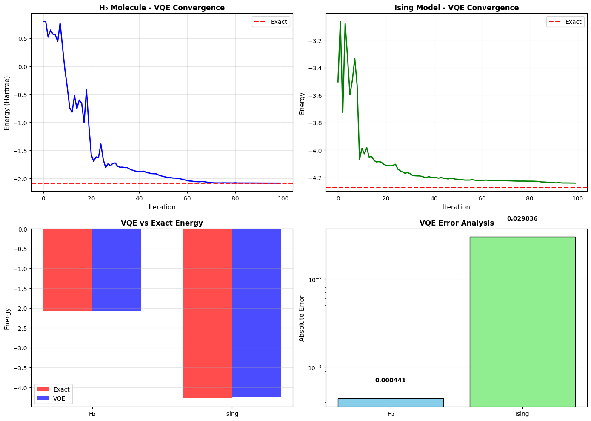
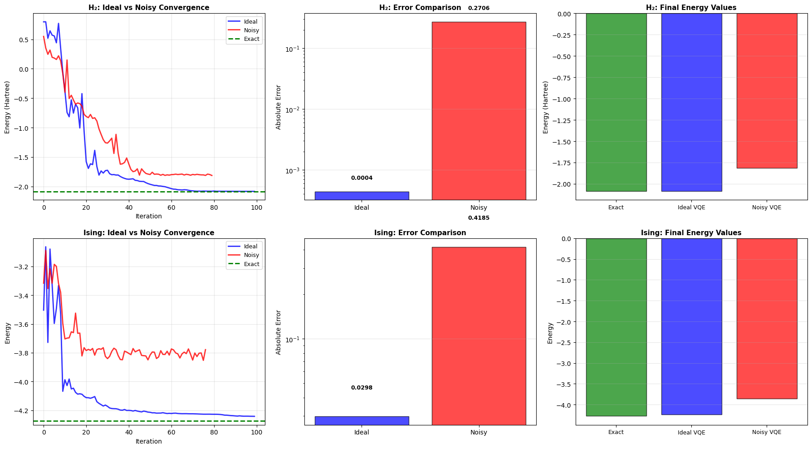
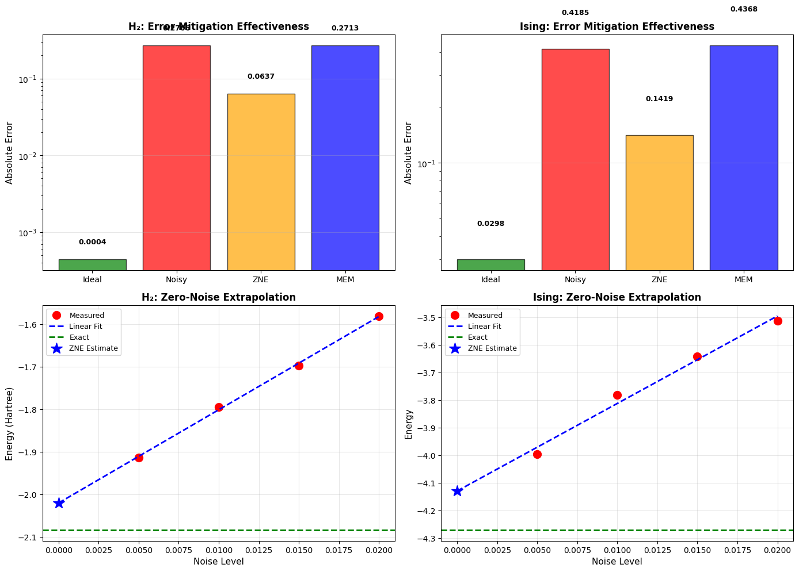
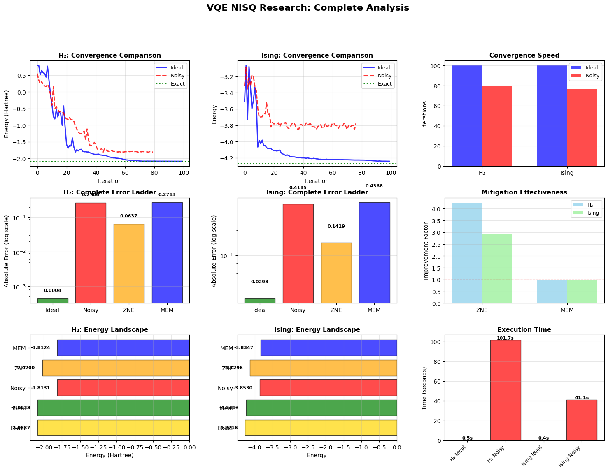

# VQE NISQ Research

A complete implementation and analysis of the Variational Quantum Eigensolver (VQE) on NISQ-era quantum devices. The project compares ideal noiseless simulation, noisy simulation with depolarizing errors, and two error mitigation techniques (Zero-Noise Extrapolation and Measurement Error Mitigation) across two quantum systems: the H2 molecule from quantum chemistry and the transverse field Ising model from condensed matter physics.

## Overview

This project investigates whether VQE can deliver useful accuracy on realistic near-term quantum hardware, and whether error mitigation can recover the accuracy lost to noise. It proceeds in three stages: ideal simulation using exact statevector evaluation, noisy simulation using a depolarizing noise model with 4096 shots per Pauli term, and error mitigation using Zero-Noise Extrapolation and Measurement Error Mitigation.

## Key Results

| System | Exact | Ideal VQE | Noisy VQE | ZNE | MEM |
|---|---|---|---|---|---|
| H2 (Hartree) | -2.083700 | -2.083259 (0.02%) | -1.813098 (12.99%) | -2.020024 (3.06%) | -1.812420 (13.02%) |
| Ising | -4.271558 | -4.241723 (0.70%) | -3.853027 (9.80%) | -4.129639 (3.32%) | -3.834734 (10.23%) |

Highlights:

- Ideal VQE achieves chemical accuracy for the H2 molecule at 0.021 percent relative error.
- One percent single-qubit gate error degrades accuracy by 613x for H2 and 14x for Ising.
- Zero-Noise Extrapolation reduces error by 4.25x for H2 and 2.95x for Ising.
- Measurement Error Mitigation was ineffective in the scalar form used here.
- System-specific noise sensitivity is significant: H2 is roughly 44 times more sensitive than Ising.

## Systems Studied

### H2 Molecule (Quantum Chemistry)

- Bond length: 0.735 Angstroms, equilibrium geometry.
- Qubits: 4, reduced Hamiltonian with 17 Pauli terms.
- Exact ground energy: -2.083700 Hartree, from classical diagonalization.
- Structure includes Z terms for electronic interactions and X/Y terms for electron correlation.
- Represents the quantum chemistry case and the target of chemical accuracy benchmarks.

### Transverse Field Ising Model (Condensed Matter)

- Qubits: 4 arranged on a periodic ring, with coupling J = 1.0 and field h = 0.5.
- Hamiltonian: 8 Pauli terms, four ZZ couplings and four X field terms.
- Exact ground energy: -4.271558 from classical diagonalization.
- Represents the condensed matter case and serves as a simpler control for comparison.

## Methodology

- Ansatz: hardware-efficient circuit with two layers of RY rotations and a ring of CNOT entanglers, giving 8 trainable parameters per system.
- Optimizer: COBYLA with up to 100 iterations for ideal runs and 80 for noisy runs.
- Initial parameters: random uniform draws from the interval [0, pi/4].
- Ideal simulation: exact statevector evaluation from Qiskit's quantum_info module, no shot noise.
- Noisy simulation: Qiskit Aer with a depolarizing noise model, 1 percent single-qubit error, 2 percent two-qubit error, and 4096 measurement shots per Pauli term.
- Error mitigation: Zero-Noise Extrapolation runs the circuit at four noise levels and linearly extrapolates to zero; Measurement Error Mitigation calibrates readout errors using a small set of basis states.

## Repository Structure

    notebooks/VQE_B22PH005.ipynb    Full implementation in Jupyter
    results/                        Generated plots and final report
    requirements.txt                Python dependencies
    LICENSE                         MIT License
    README.md                       This file

## Quickstart

Clone the repository and install dependencies:

    git clone https://github.com/Athleity/VQE-NISQ-research.git
    cd VQE-NISQ-research
    pip install -r requirements.txt
    jupyter notebook notebooks/VQE_B22PH005.ipynb

Or open directly in Google Colab:

## Results and Visualizations

### Ideal VQE Convergence

This figure shows VQE converging to the exact ground-state energy for both systems in the ideal noiseless case. The top-left and top-right panels show the energy history over 100 iterations. The bottom panels compare final VQE energies to the exact values and show the error on a log scale. H2 reaches 0.021 percent relative error, well within chemical accuracy, while Ising reaches 0.70 percent relative error.

### Ideal vs Noisy Comparison

This figure directly compares ideal and noisy VQE runs side by side. The top row shows the noisy run diverging from the ideal trajectory, with H2 ending at -1.81 Hartree and Ising ending at -3.85. The bottom row shows the resulting error on a log scale, making the degradation visually clear.

### Error Mitigation Effectiveness

This figure quantifies how well each error mitigation technique performed. The top row shows absolute errors before and after mitigation on a log scale. The bottom row shows the Zero-Noise Extrapolation fits, where the measured energies at four noise levels are linearly extrapolated back to zero noise. ZNE brings H2 error from 0.271 down to 0.064 and Ising error from 0.419 down to 0.142, but MEM does not help in either case.

### Complete Analysis

The complete analysis figure brings together nine panels covering convergence, error ladders, mitigation effectiveness, final energy landscapes, and execution time. This is the most comprehensive single view of the project's results.

## Findings

1. Ideal VQE achieves chemical accuracy for the H2 molecule at 0.021 percent relative error, well below the 1 kcal per mole threshold.

2. Realistic depolarizing noise severely degrades performance, causing 10 to 13 percent energy error at only 1 percent single-qubit gate error.

3. The H2 molecule is roughly 44 times more noise-sensitive than the Ising model because it has 17 Pauli terms versus 8 for Ising, requiring many more basis rotations and thus more accumulated gate error.

4. Zero-Noise Extrapolation is an effective mitigation technique and reduces error by 3 to 4 times across both systems, though the final errors still exceed chemical accuracy.

5. Measurement Error Mitigation was ineffective in the scalar implementation used here; a full matrix-inversion approach would likely perform better.

6. Runtime overhead grows dramatically under noise, from fractions of a second in ideal simulation to over 100 seconds for noisy H2, due to per-term measurement with 4096 shots each.

## Limitations

- Only 4-qubit systems were studied, which limits generalizability to larger molecules and longer spin chains.
- The depolarizing noise model is idealized and does not capture leakage, crosstalk, or coherent error channels that affect real hardware.
- The Measurement Error Mitigation implementation used a single scalar correction factor rather than inverting the full calibration matrix, which likely limited its effectiveness.
- No statistical error bars are reported because ideal runs use exact statevector evaluation and noisy runs use a fixed random seed by convention.
- The ansatz was hardware-efficient but not tailored to either system, which may have limited the achievable accuracy in the ideal case.

## Future Work

- Test the same circuits on real IBM Quantum hardware to obtain a realistic noise profile.
- Scale to larger molecules such as LiH and H2O to check whether the observed trends hold.
- Explore adaptive ansatz designs like ADAPT-VQE, which build circuits iteratively and may reduce depth for a given accuracy target.
- Improve Measurement Error Mitigation by inverting the full calibration matrix instead of using a scalar correction.
- Compare VQE against other NISQ algorithms such as QAOA and SSVQE on the same systems to identify which algorithm is best suited to which problem class.

## References

1. Peruzzo et al., A variational eigenvalue solver on a photonic quantum processor, Nature Communications 5, 4213 (2014).
2. Kandala et al., Hardware-efficient variational quantum eigensolver for small molecules and quantum magnets, Nature 549, 242 (2017).
3. Temme et al., Error mitigation for short-depth quantum circuits, Physical Review Letters 119, 180509 (2017).
4. Qiskit Development Team, https://qiskit.org

## License

This project is released under the MIT License. See [LICENSE](LICENSE) for details.

## Author

Athleity, [@Athleity](https://github.com/Athleity)

